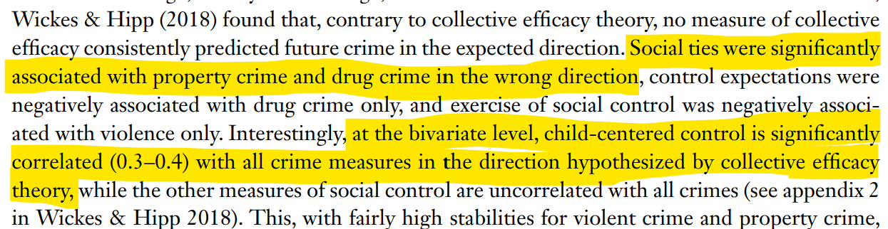
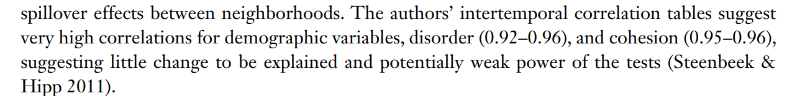

---
author:
  - name: Charles C. Lanfear
    affiliations: University of Cambridge
  - name: Thiago R. Oliveira
    affiliations: University of Manchester
title: Reciprocal relationships, reverse causality, and temporal ordering
subtitle: Testing theories with cross-lagged panel models
format:
  revealjs:
    theme: assets/cclslides.scss
    incremental: false
    self-contained: true
    width: 1200
    height: 800
    auto-stretch: true
    title-slide-attributes:
      data-background-image: img/paisley.png
      data-background-position: bottom
      data-background-size: contain
filters: 
  - assets/invert-h1.lua
editor: source
mouse-wheel: true
history: false
---

```{r}
#| label: "setup"
#| include: false
library(tidyverse)
library(showtext)
slide_font <- "EB Garamond"
font_add_google(name = slide_font)
showtext_auto()
```


## What is this?

We were invited to write a on **Cross-Lagged Panel Models** (CLPM) for the *Journal of Developmental and Life Course Criminology*^[I'll be using social-ecological examples today though]

&nbsp;

. . .

CLPMs are commonly used to examine **reciprocality** in *developmental* and *life course* research


## Reciprocality

&nbsp;

```{tikz, echo = FALSE, cache=TRUE, fig.ext = "svg", engine.opts=list(dvisvgm.opts= "--no-fonts")}
\usetikzlibrary{positioning}
\definecolor{black}{HTML}{000000}
\tikzset{
    > = stealth,
    every node/.append style = {
        draw = none
    },
    every path/.append style = {
        arrows = ->,
        draw = black,
        fill = none
    },
    hidden/.style = {
        draw = black,
        shape = circle,
        inner sep = 1pt
    }
}
\tikz{
    \node (y) at (0,1.5) {$Fear$};
    \node (x) at (0,0) {$Disorder$};
    \path (x) edge [bend left=45, arrows = ->] (y);
    \path (y) edge [bend left=45, arrows = ->] (x);
    \node (y) at (3,1.5) {$Crime$};
    \node (x) at (3,0) {$Employment$};
    \path (x) edge [bend left=45, arrows = ->] (y);
    \path (y) edge [bend left=45, arrows = ->] (x);
  }
```

## What is this?

We were invited to write a on **Cross-Lagged Panel Models** (CLPM) for the *Journal of Developmental and Life Course Criminology*

&nbsp;

CLPMs are commonly used to examine **reciprocality** in *developmental* and *life course* research

&nbsp;

. . .


::: {.center}
*They are also often used thoughtlessly or unnecessarily*
:::


## From Hell's heart I stab at thee

We were invited to write a on **Cross-Lagged Panel Models** (CLPM) for the *Journal of Developmental and Life Course Criminology*

&nbsp;

CLPMs are commonly used to examine **reciprocality** in *developmental* and *life course* research

&nbsp;

::: {.center}
*They are also often used thoughtlessly or unnecessarily*
:::


::: {.center}
~~*This vexes me*~~ <br>
*This is an effort to provide accessible guidance*
:::


. . .

&nbsp;

But first, what is a cross-lagged panel model?

## The classic CLPM

&nbsp;

```{tikz, echo = FALSE, cache=TRUE, fig.ext = "svg", engine.opts=list(dvisvgm.opts= "--no-fonts")}
\usetikzlibrary{positioning}
\definecolor{black}{HTML}{000000}
\tikzset{
    > = stealth,
    every node/.append style = {
        draw = none
    },
    every path/.append style = {
        arrows = ->,
        draw = black,
        fill = none
    },
    hidden/.style = {
        draw = black,
        shape = circle,
        inner sep = 1pt
    }
}
\tikz{
    \node (y1a) at (0,2) {$Y_1$};
    \node (y2a) at (2,2) {$Y_2$};
    \node (y3a) at (4,2) {$Y_3$};
    \node (x1a) at (0,0) {$X_1$};
    \node (x2a) at (2,0) {$X_2$};
    \node (x3a) at (4,0) {$X_3$};
    \path (x1a) edge (x2a);
    \path (x2a) edge (x3a);
    \path (x1a) edge (y2a);
    \path (x2a) edge (y3a);
    \path (y1a) edge (y2a);
    \path (y2a) edge (y3a);
    \path (y1a) edge (x2a);
    \path (y2a) edge (x3a);
  }
```

&nbsp;

Provided repeated observations, cross-lags "enforce" temporal order

Strength and direction inferred from cross-lagged path estimates

The *hammer* for panel data's *nail*

## Does this make sense with yearly panel data?

&nbsp;

```{tikz, echo = FALSE, cache=TRUE, fig.ext = "svg", engine.opts=list(dvisvgm.opts= "--no-fonts")}
\usetikzlibrary{positioning}
\definecolor{black}{HTML}{000000}
\tikzset{
    > = stealth,
    every node/.append style = {
        draw = none
    },
    every path/.append style = {
        arrows = ->,
        draw = black,
        fill = none
    },
    hidden/.style = {
        draw = black,
        shape = circle,
        inner sep = 1pt
    }
}
\tikz{
    \node (y1a) at (0,2) {$Fear_1$};
    \node (y2a) at (2.5,2) {$Fear_2$};
    \node (y3a) at (5,2) {$Fear_3$};
    \node (x1a) at (0,0) {$Disorder_1$};
    \node (x2a) at (2.5,0) {$Disorder_2$};
    \node (x3a) at (5,0) {$Disorder_3$};
    \path (x1a) edge (x2a);
    \path (x2a) edge (x3a);
    \path (x1a) edge (y2a);
    \path (x2a) edge (y3a);
    \path (y1a) edge (y2a);
    \path (y2a) edge (y3a);
    \path (y1a) edge (x2a);
    \path (y2a) edge (x3a);
  }
```

&nbsp;

When would we expect observing disorder to impact fear?

## Another common form

&nbsp;

```{tikz, echo = FALSE, cache=TRUE, fig.ext = "svg", engine.opts=list(dvisvgm.opts= "--no-fonts")}
\usetikzlibrary{positioning}
\definecolor{black}{HTML}{000000}
\tikzset{
    > = stealth,
    every node/.append style = {
        draw = none
    },
    every path/.append style = {
        arrows = ->,
        draw = black,
        fill = none
    },
    hidden/.style = {
        draw = black,
        shape = circle,
        inner sep = 1pt
    }
}
\tikz{
    \node[align=center] (title1) at (2,2.75) {(a) Lagged effects only};
    \node (y1a) at (0,2) {$Y_1$};
    \node (y2a) at (2,2) {$Y_2$};
    \node (y3a) at (4,2) {$Y_3$};
    \node (x1a) at (0,0) {$X_1$};
    \node (x2a) at (2,0) {$X_2$};
    \node (x3a) at (4,0) {$X_3$};
    \path (x1a) edge (x2a);
    \path (x2a) edge (x3a);
    \path (x1a) edge (y2a);
    \path (x2a) edge (y3a);
    \path (y1a) edge (y2a);
    \path (y2a) edge (y3a);
    \path (y1a) edge (x2a);
    \path (y2a) edge (x3a);
    
    \node[align=center] (title2) at (8,2.75) {(b) Contemporaneous effects};
    \node (y1b) at (6,2) {$Y_1$};
    \node (y2b) at (8,2) {$Y_2$};
    \node (y3b) at (10,2) {$Y_3$};
    \node (x1b) at (6,0) {$X_1$};
    \node (x2b) at (8,0) {$X_2$};
    \node (x3b) at (10,0) {$X_3$};
    \path (x1b) edge (x2b);
    \path (x2b) edge (x3b);
    \path (x1b) edge (y2b);
    \path (x2b) edge (y3b);
    \path (y1b) edge (y2b);
    \path (y2b) edge (y3b);
    \path (y1b) edge (x2b);
    \path (y2b) edge (x3b);
    \path (x1b) edge (y1b);
    \path (x2b) edge (y2b);
    \path (x3b) edge (y3b);
  }
```

&nbsp;

Can capture immediate effects... but assumes the problem away 

## Our message {.dark-slide}

&nbsp;

Good empirical research starts with a **strong theoretical foundation**

&nbsp;

Consider whether your data can answer your question

&nbsp;

You should default to robust estimators


## Our approach

&nbsp;

**The world is recursive**

* Non-recursive *theory* is a symptom of ignoring **time** or **mechanisms**
* Use a *directed acyclic graphs* (DAG) for theories

::: {.fragment fragment-index=1}

**Data are imperfect**

* *Estimators* must often handle ambiguity, and assumptions should be clear
* Use classical *structural equation model* (SEM) path diagrams for estimators
   * The structural model should be non-recursive[^1] and derived from the theoretical DAG

:::


[^1]: [Non-recursive simultaneous equations need multiple plausible IVs that I know you don't have]{.fragment fragment-index=1}


## DAG for theory

&nbsp;

```{tikz, echo = FALSE, cache=TRUE, fig.ext = "svg", engine.opts=list(dvisvgm.opts= "--no-fonts")}
\usetikzlibrary{positioning}
\definecolor{black}{HTML}{000000}
\tikzset{
    > = stealth,
    every node/.append style = {
        draw = none
    },
    every path/.append style = {
        arrows = ->,
        draw = black,
        fill = none
    },
    hidden/.style = {
        draw = black,
        shape = circle,
        inner sep = 1pt
    }
}
\tikz{
    \node[align=center] (title1) at (2,2.75) {(a) Lagged effects only};
    \node (y1a) at (0,2) {$Y_1$};
    \node (y2a) at (2,2) {$Y_2$};
    \node (y3a) at (4,2) {$Y_3$};
    \node (x1a) at (0,0) {$X_1$};
    \node (x2a) at (2,0) {$X_2$};
    \node (x3a) at (4,0) {$X_3$};
    \path (x1a) edge (x2a);
    \path (x2a) edge (x3a);
    \path (x1a) edge (y2a);
    \path (x2a) edge (y3a);
    \path (y1a) edge (y2a);
    \path (y2a) edge (y3a);
    \path (y1a) edge (x2a);
    \path (y2a) edge (x3a);
    
    \node[align=center] (title2) at (8,2.75) {(b) Contemporaneous effects};
    \node (y1b) at (6,2) {$Y_1$};
    \node (y2b) at (8,2) {$Y_2$};
    \node (y3b) at (10,2) {$Y_3$};
    \node (x1b) at (6,0) {$X_1$};
    \node (x2b) at (8,0) {$X_2$};
    \node (x3b) at (10,0) {$X_3$};
    \path (x1b) edge (x2b);
    \path (x2b) edge (x3b);
    \path (x1b) edge (y2b);
    \path (x2b) edge (y3b);
    \path (y1b) edge (y2b);
    \path (y2b) edge (y3b);
    \path (y1b) edge (x2b);
    \path (y2b) edge (x3b);
    \path (x1b) edge (y1b);
    \path (x2b) edge (y2b);
    \path (x3b) edge (y3b);
  }
```


## SEM for estimation

&nbsp;

```{tikz, echo = FALSE, cache = TRUE, fig.ext = "svg", engine.opts=list(dvisvgm.opts= "--no-fonts") }
\usetikzlibrary{positioning}
\definecolor{black}{HTML}{000000}
\tikzset{
    > = stealth,
    every node/.append style = {
        draw = none
    },
    every path/.append style = {
        arrows = ->,
        draw = black,
        fill = none
    },
    hidden/.style = {
        draw = black,
        shape = circle,
        inner sep = 1pt
    }
}
\tikz{
    \node[align=center] (title1) at (2,3.5) {(a) Lagged effects only};
    \node (y1) at (0,2) {$Y_1$};
    \node (y2) at (2,2) {$Y_2$};
    \node (y3) at (4,2) {$Y_3$};
    \node (x1) at (0,0) {$X_1$};
    \node (x2) at (2,0) {$X_2$};
    \node (x3) at (4,0) {$X_3$};
    
    \node[hidden] (ey2) at (2.5,3) {$\epsilon_{2}$};
    \node[hidden] (ex2) at (2.5,-1) {$\zeta_{2}$};
    \node[hidden] (ey3) at (4.5,3) {$\epsilon_{3}$};
    \node[hidden] (ex3) at (4.5,-1) {$\zeta_{3}$};
    
    \path (x1) edge (x2);
    \path (x2) edge (x3);
    \path (x1) edge (y2);
    \path (x2) edge (y3);
    \path (y1) edge (y2);
    \path (y2) edge (y3);
    \path (y1) edge (x2);
    \path (y2) edge (x3);
    \path (x1) edge [gray, thin, bend left=60, arrows = <->] (y1);
    \path (ex2) edge [gray, thin, bend right=30, arrows = <->] (ey2);
    \path (ex3) edge [gray, thin, bend right=30, arrows = <->] (ey3);
    \path (ex2) edge (x2);
    \path (ex3) edge (x3);
    \path (ey2) edge (y2);
    \path (ey3) edge (y3);
  
    \node[align=center] (title2) at (8,3.5) {(b) Contemporaneous effects};
    \node (y1b) at (6,2) {$Y_1$};
    \node (y2b) at (8,2) {$Y_2$};
    \node (y3b) at (10,2) {$Y_3$};
    \node (x1b) at (6,0) {$X_1$};
    \node (x2b) at (8,0) {$X_2$};
    \node (x3b) at (10,0) {$X_3$};
    
    \node[hidden] (ey1b) at (6.5,3) {$\epsilon_{1}$};
    \node[hidden] (ey2b) at (8.5,3) {$\epsilon_{2}$};
    \node[hidden] (ex2b) at (8.5,-1) {$\zeta_{2}$};
    \node[hidden] (ey3b) at (10.5,3) {$\epsilon_{3}$};
    \node[hidden] (ex3b) at (10.5,-1) {$\zeta_{3}$};
    
    
    \path (x1b) edge (x2b);
    \path (x2b) edge (x3b);
    
    \path (x1b) edge (y1b);
    \path (x1b) edge (y2b);
    \path (x2b) edge (y2b);
    \path (x2b) edge (y3b);
    \path (x3b) edge (y3b);
    
    \path (y1b) edge (y2b);
    \path (y2b) edge (y3b);
    \path (y1b) edge (x2b);
    \path (y2b) edge (x3b);

    \path (ex2b) edge (x2b);
    \path (ex3b) edge (x3b);
    \path (ey1b) edge (y1b);
    \path (ey2b) edge (y2b);
    \path (ey3b) edge (y3b);
  }
```

We can clearly encode ambiguities and assumptions


## The process

Clear theory is a prerequisite before specifying an estimator:

* Derive recursive **model** from theory
   * Use a DAG or recursive equation
   * Include unobserved mechanisms when appropriate

. . .

* Specify **estimand**
   * Quantitative definition of the estimate of interest

. . .

* Specify **estimator**
   * Contemporaneous (fast) vs. lagged (slow) effects in structure
   * Covariances to address ambiguity and relax assumptions


## When is a CLPM needed

> A cross-lagged panel model is only needed when reciprocal effects over time are presumed in the theoretical model. When the researcher can theoretically assume no effects of the dependent variable on the independent variable over time, other statistical models will be more appropriate than a cross-lagged panel model 

. . .

Two forms of reciprocality:

* **Theoretical reciprocality** (substance)
* **Reverse causality** (nuisance)

## Two forms

&nbsp;

```{tikz, echo = FALSE, cache=TRUE, fig.ext = "svg", engine.opts=list(dvisvgm.opts= "--no-fonts")}
\usetikzlibrary{positioning}
\definecolor{black}{HTML}{000000}
\tikzset{
    > = stealth,
    every node/.append style = {
        draw = none
    },
    every path/.append style = {
        arrows = ->,
        draw = black,
        fill = none
    },
    hidden/.style = {
        draw = black,
        shape = circle,
        inner sep = 1pt
    }
}
\tikz{
    \node[align=center] (title1) at (0,2.25) {Substantive};
    \node (y) at (0,1.5) {$Fear$};
    \node (x) at (0,0) {$Disorder$};
    \path (x) edge [bend left=45, arrows = ->] (y);
    \path (y) edge [bend left=45, arrows = ->] (x);
    \node[align=center] (title1) at (3,2.25) {Nuisance};
    \node (y) at (3,1.5) {$Crime$};
    \node (x) at (3,0) {$Employment$};
    \path (x) edge [bend left=45, arrows = ->] (y);
    \path (y) edge [dashed, bend left=45, arrows = ->] (x);
  }
```


# Panel data

## It comes in waves

&nbsp;

```{tikz, fig.ext = "svg", cache = TRUE, engine.opts=list(dvisvgm.opts= "--no-fonts")}
\usetikzlibrary{positioning}
\definecolor{black}{HTML}{000000}
\tikzset{
    > = stealth,
    every node/.append style = {
        draw = none
    },
    every path/.append style = {
        arrows = ->,
        draw = black,
        fill = none
    },
    hidden/.style = {
        draw = black,
        shape = circle,
        inner sep = 1pt
    }
}
\tikz{
    \node (x1) at (0,2) {$X_1$};
    \node[hidden] (x15) at (2,2) {$X_{1.5}$};
    \node (x2) at (4,2) {$X_2$};
    \node[hidden] (x25) at (6,2) {$X_{2.5}$};
    \node (x3) at (8,2) {$X_3$};
    \node (y1) at (0,0) {$Y_1$};
    \node[hidden] (y15) at (2,0) {$Y_{1.5}$};
    \node (y2) at (4,0) {$Y_2$};
    \node[hidden] (y25) at (6,0) {$Y_{2.5}$};
    \node (y3) at (8,0) {$Y_3$};
    \path (x1) edge (x15);
    \path (x15) edge (x2);
    \path (x2) edge (x25);
    \path (x25) edge (x3);
    \path (x1) edge (y15);
    \path (x15) edge (y2);
    \path (x2) edge (y25);
    \path (x25) edge (y3);
    \path (y1) edge (y15);
    \path (y15) edge (y2);
    \path (y2) edge (y25);
    \path (y25) edge (y3);
    \path (y1) edge (x15);
    \path (y15) edge (x2);
    \path (y2) edge (x25);
    \path (y25) edge (x3);
  }
```

Observations rarely correspond perfectly to a theoretical timing of interest

Time is continuous anyway; missing data are *infinite*

## Composite variables


Key problems:

* Consistency violations (multiple treatments at each level)
* Time-varying confounding (components have different causes)

## Oh no

&nbsp;

```{tikz, fig.ext = "svg", cache = TRUE, engine.opts=list(dvisvgm.opts= "--no-fonts")}
\usetikzlibrary{positioning}
\usetikzlibrary{decorations.pathreplacing}
\definecolor{black}{HTML}{000000}
\tikzset{
    > = stealth,
    every node/.append style = {
        draw = none
    },
    every edge/.append style = {
        arrows = ->,
        fill = none
    },
    hidden/.style = {
        draw = black,
        shape = circle,
        inner sep = 1pt
    }
}
\tikz{
    
    \node (y1) at (2.5,0.5) {$Y$};

    
    \node (x1) at (1, 0.5) {$X$};
    
    \node[hidden] (x1a) at (0,1) {$X_{A}$};
    \node[hidden] (x1b) at (0,0) {$X_{B}$};
    % latent -> obs
       % X->X%
    \draw[->, double] (x1a) to (x1);
    \draw[->, double] (x1b) to (x1);
 
    % Y->Y%
     \path (x1) edge [dashed, bend left=60, arrows = ->] (y1);
     \path (x1a) edge (y1);
     \path (y1) edge (x1b);
  }
```

Even worse when components aren't simultaneously determined

## Composite period variables

Many common measures in panel studies are composites:

* Time spent (un)employed
* Number of crimes committed

. . .

> When our observation periods do not correspond to the timing of our underlying theoretical causal model, these period measures become what we will call **composite period variables**. They are a composite because the measured value is a deterministic sum of values that would be obtained by dividing the observation period up into smaller intervals and aggregating across them.

## Oh noes

```{tikz, fig.ext = "svg", cache = TRUE, engine.opts=list(dvisvgm.opts= "--no-fonts")}
\usetikzlibrary{positioning}
\usetikzlibrary{decorations.pathreplacing}
\definecolor{black}{HTML}{000000}
\tikzset{
    > = stealth,
    every node/.append style = {
        draw = none
    },
    every edge/.append style = {
        arrows = ->,
        fill = none
    },
    hidden/.style = {
        draw = black,
        shape = circle,
        inner sep = 1pt
    }
}
\tikz{

    \draw[|-|] (-0.6,4.25) -- (1.8,4.25);
    \draw[-|] (1.8,4.25) -- (4.2,4.25);
    \draw[-|] (4.2,4.25) -- (6.6,4.25);
    
    \draw [decorate,decoration={brace,amplitude=5pt,mirror,raise=1ex}] (-0.6,4.25) -- (0.6,4.25) node[midway,yshift=-1.5em]{A};
    \draw [decorate,decoration={brace,amplitude=5pt,mirror,raise=1ex}] (0.6,4.25) -- (1.8,4.25) node[midway,yshift=-1.5em]{B};
    \draw [decorate,decoration={brace,amplitude=5pt,mirror,raise=1ex}] (1.8,4.25) -- (3,4.25) node[midway,yshift=-1.5em]{A};
    \draw [decorate,decoration={brace,amplitude=5pt,mirror,raise=1ex}] (3,4.25) -- (4.2,4.25) node[midway,yshift=-1.5em]{B};
    \draw [decorate,decoration={brace,amplitude=5pt,mirror,raise=1ex}] (4.2,4.25) -- (5.4,4.25) node[midway,yshift=-1.5em]{A};
    \draw [decorate,decoration={brace,amplitude=5pt,mirror,raise=1ex}] (5.4,4.25) -- (6.6,4.25) node[midway,yshift=-1.5em]{B};
    
    
    \node[align=center] (obs1) at (-2,4.25) {Time\\Intervals};
    \node[align=center] (obs1) at (-2,1.5) {Latent\\Causal\\Model};
    %\node[align=center] (obs1) at (-2,-2) {Observed\\Associations};%
    
    \node[align=center] (obs1) at (-0.6,4.75) {Start};
    \node[align=center] (obs1) at (1.8,4.75) {Observation\\Time 1};
    \node[align=center] (obs1) at (4.2,4.75) {Observation\\Time 2};
    \node[align=center] (obs1) at (6.6,4.75) {Observation\\Time 3};
    
    
    \node (y1) at (0.6,3) {$Y_1$};
    \node (y2) at (3,3) {$Y_2$};
    \node (y3) at (5.4,3) {$Y_3$};
    
    \node[hidden] (y1a) at (0,2) {$Y_{1A}$};
    \node[hidden] (y1b) at (1.2,2) {$Y_{1B}$};
    \node[hidden] (y2a) at (2.4,2) {$Y_{2A}$};
    \node[hidden] (y2b) at (3.6,2) {$Y_{2B}$};
    \node[hidden] (y3a) at (4.8,2) {$Y_{3A}$};
    \node[hidden] (y3b) at (6,2) {$Y_{3B}$};
    
    \node (x1) at (0.6,0) {$X_1$};
    \node (x2) at (3,0) {$X_2$};
    \node (x3) at (5.4,0) {$X_3$};
    
    \node[hidden] (x1a) at (0,1) {$X_{1A}$};
    \node[hidden] (x1b) at (1.2,1) {$X_{1B}$};
    \node[hidden] (x2a) at (2.4,1) {$X_{2A}$};
    \node[hidden] (x2b) at (3.6,1) {$X_{2B}$};
    \node[hidden] (x3a) at (4.8,1) {$X_{3A}$};
    \node[hidden] (x3b) at (6,1) {$X_{3B}$};
    % latent -> obs
       % X->X%
    \draw[->, double] (x1a) to (x1);
    \draw[->, double] (x1b) to (x1);
    \draw[->, double] (x2a) to (x2);
    \draw[->, double] (x2b) to (x2);
    \draw[->, double] (x3a) to (x3); 
    \draw[->, double] (x3b) to (x3); 
    \draw[->, double] (y1a) to (y1);
    \draw[->, double] (y1b) to (y1);
    \draw[->, double] (y2a) to (y2);
    \draw[->, double] (y2b) to (y2);
    \draw[->, double] (y3a) to (y3); 
    \draw[->, double] (y3b) to (y3); 
    % Y->Y%
    \path (y1a) edge (y1b);
    \path (y1b) edge (y2a);
    \path (y2a) edge (y2b);
    \path (y2b) edge (y3a);
    \path (y3a) edge (y3b);
   % X->X%
    \path (x1a) edge (x1b);
    \path (x1b) edge (x2a);
    \path (x2a) edge (x2b);
    \path (x2b) edge (x3a);
    \path (x3a) edge (x3b); 
       % X->Y%
    \path (x1a) edge (y1b);
    \path (x1b) edge (y2a);
    \path (x2a) edge (y2b);
    \path (x2b) edge (y3a);
    \path (x3a) edge (y3b); 
       % Y->X%
    \path (y1a) edge (x1b);
    \path (y1b) edge (x2a);
    \path (y2a) edge (x2b);
    \path (y2b) edge (x3a);
    \path (y3a) edge (x3b); 
  }
```


# Theory, estimands, and time

## Start with theory

> CLPMs are frequently used without careful attention to the theoretical process they are meant to capture... 

> the definition of the causal quantity of interest---the **estimand**---is often left implicit, determined not by theory but by the structure of the available data. 

"the effect of last year's informal social control on this year's crime"

> When the starting point is not a clearly specified causal process, one risks arriving at an estimator that produces a **correct answer** to the **wrong question**.

## The one true causal timing

&nbsp;

Estimands connect your theoretical question to your data by specifying:

* Value of exposure
  * E.g., a counterfactual difference
* **Timing of effect**

&nbsp;

> what is important is recognizing that there is no “true causal timing” waiting to be discovered because causal timing is a choice a researcher makes when defining their estimand of interest. (p.4)


## Drinking problems {.r-fit-text}

&nbsp;

> what is the true causal timing of drinking an additional pint of beer
on one’s perceived wellbeing? What is this effect at 20 seconds, 20 minutes, 20 hours, or 20 years? What about the effect of an additional pint per day after 10 years? In this context, the reader may know intimately which exposure and which lags between measurement of exposure and outcome correspond to detectable and substantively interesting causal effects. Strong theories should be specific about the role of time and thus able to inform what sort of causal timings—whether delay between exposure and outcome or aggregations of exposures—are of substantive interest. 

## An example

&nbsp;

Theories^[E.g., Sampson & Laub 1993; Hirschi 1969; St. Jerome 411] *employment* reduces *offending*---with obvious reverse causality as offending threatens job loss---and we have *yearly* data

. . .

* If we think employment reduces offending by keeping people involved in day-to-day activities... [*we probably want daily or weekly data instead!*]{.fragment}

. . .

* But if we think employment reduces offending by gradually committing people to conventional life... [*our yearly data might be useful!*]{.fragment}

. . .

A feasible estimand: *The expected reduction in number of self-reported offenses in the present year per additional week of work in the past year*

## Good, an answerable question! {.dark-slide}

&nbsp;

Now we can move on to estimation


# Three common applied problems

## Unobserved stable heterogeneity

&nbsp;

* Autoregressive terms don't absorb time-stable confounding^[While the same problem, we usually talk about time-varying confounders differently than time stable ones]
* Cross-lagged terms mix within-unit change with between-unit differences
* Can't just toss in fixed effects due to Nickell bias from endogenous lag
   * Bias shrinks in proportion to T
* Generally well-recognized

## Work, crime, and self-control

```{tikz, fig.ext = "svg", cache = TRUE, engine.opts=list(dvisvgm.opts= "--no-fonts")}
\usetikzlibrary{positioning}
\definecolor{black}{HTML}{000000}
\tikzset{
    > = stealth,
    every node/.append style = {
        draw = none
    },
    every path/.append style = {
        arrows = ->,
        draw = black,
        fill = none
    },
    hidden/.style = {
        draw = black,
        shape = circle,
        inner sep = 2pt
    }
}
\tikz{
    \node (x1) at (0,0) {$Work_1$};
    \node (x2) at (2,0) {$Work_2$};
    \node (x3) at (4,0) {$Work_3$};
    \node (x4) at (6,0) {$Work_4$};
    
    \node (y1) at (0,2) {$Crime_1$};
    \node (y2) at (2,2) {$Crime_2$};
    \node (y3) at (4,2) {$Crime_3$};
    \node (y4) at (6,2) {$Crime_4$};
    
    \node[hidden, align=center] (alpha) at (-2,1) {$Self$ \\ $Control$};
    
    \path (y1) edge (y2);
    \path (y2) edge (y3);
    \path (y3) edge (y4);
    
    \path (x1) edge (x2);
    \path (x2) edge (x3);
    \path (x3) edge (x4);
        
    \path (x1) edge (y2);
    \path (x2) edge (y3);
    \path (x3) edge (y4);
    
    \path (x1) edge (y1);
    \path (x2) edge (y2);
    \path (x3) edge (y3);
    \path (x4) edge (y4);
    
    \path (alpha) edge  (y1);
    \path (alpha) edge [bend left=45] (y2);
    \path (alpha) edge [bend left=45] (y3);
    \path (alpha) edge [bend left=45] (y4);
    
    \path (alpha) edge (x1);
    \path (alpha) edge [bend right=45] (x2);
    \path (alpha) edge [bend right=45] (x3);
    \path (alpha) edge [bend right=45] (x4);
    

  }
```

Confounded by a time-stable trait of individuals

## Solution 1: Allison et al.'s (2017) ML-SEM

```{tikz, fig.ext = "svg", cache = TRUE, engine.opts=list(dvisvgm.opts= "--no-fonts")}
\usetikzlibrary{positioning}
\definecolor{black}{HTML}{000000}
\tikzset{
    > = stealth,
    every node/.append style = {
        draw = none
    },
    every path/.append style = {
        arrows = ->,
        draw = black,
        fill = none
    },
    hidden/.style = {
        draw = black,
        shape = circle,
        inner sep = 2pt
    }
}
\tikz{
    \node (x1) at (0,0) {$X_1$};
    \node (x2) at (2,0) {$X_2$};
    \node (x3) at (4,0) {$X_3$};
    \node (x4) at (6,0) {$X_4$};
    
    \node (y1) at (0,2) {$Y_1$};
    \node (y2) at (2,2) {$Y_2$};
    \node (y3) at (4,2) {$Y_3$};
    \node (y4) at (6,2) {$Y_4$};
    
    \node[hidden] (alpha) at (-2,1) {$\alpha$};
    
    \node[hidden] (ey2) at (2,3) {$\epsilon_{2}$};
    \node[hidden] (ey3) at (4,3) {$\epsilon_{3}$};
    \node[hidden] (ey4) at (6,3) {$\epsilon_{4}$};
    
    \path (y1) edge (y2);
    \path (y2) edge (y3);
    \path (y3) edge (y4);
    
    \path (x1) edge (y2);
    \path (x2) edge (y3);
    \path (x3) edge (y4);
    
    \path (x2) edge (y2);
    \path (x3) edge (y3);
    \path (x4) edge (y4);
    
    \path (alpha) edge [gray, thin] (y2);
    \path (alpha) edge [gray, thin] (y3);
    \path (alpha) edge [gray, thin] (y4);
    
    \path (alpha) edge [bend right=45, arrows = <->, gray, thin] (x1);
    \path (alpha) edge [bend right=60, arrows = <->, gray, thin] (x2);
    \path (alpha) edge [bend right=75, arrows = <->, gray, thin] (x3);
    \path (alpha) edge [bend right=75, arrows = <->, gray, thin] (x4);
    \path (alpha) edge [bend left=45, arrows = <->, gray, thin] (y1);
    
    \path (y1) edge [bend right=60, arrows = <->, gray, thin] (x1);
    \path (y1) edge [bend right=75, arrows = <->, gray, thin] (x2);
    \path (y1) edge [bend right=90, arrows = <->, gray, thin] (x3);
    \path (y1) edge [bend right=90, arrows = <->, gray, thin] (x4);
    
    \path (x1) edge [bend right=45, arrows = <->, gray, thin] (x2);
    \path (x1) edge [bend right=45, arrows = <->, gray, thin] (x3);
    \path (x1) edge [bend right=45, arrows = <->, gray, thin] (x4);
    \path (x2) edge [bend right=45, arrows = <->, gray, thin] (x3);
    \path (x2) edge [bend right=45, arrows = <->, gray, thin] (x4);
    \path (x3) edge [bend right=45, arrows = <->, gray, thin] (x4);
    
    \path (x3) edge [bend left=80, arrows = <->, gray, thin] (ey2.225);
    \path (x4) edge [bend left=80, arrows = <->, gray, thin] (ey3.225);
    
    \path (ey2) edge [gray, thin] (y2);
    \path (ey3) edge [gray, thin] (y3);
    \path (ey4) edge [gray, thin] (y4);
    
  }
```

One-sided latent Mundlak estimator better for reverse causality

## Solution 2: Hamaker et al.'s (2015) RI-CLPM

```{tikz, cache = TRUE, fig.ext = "svg", engine.opts=list(dvisvgm.opts= "--no-fonts")}
\usetikzlibrary{positioning}
\definecolor{black}{HTML}{000000}
\tikzset{
    > = stealth,
    every node/.append style = {
        draw = none
    },
    every path/.append style = {
        arrows = ->,
        draw = black,
        fill = none
    },
    hidden/.style = {
        draw = black,
        shape = circle,
        inner sep = .75pt
    }
}
\tikz{
    \node (y1) at (0,5) {$Y_1$};
    \node (y2) at (2,5) {$Y_2$};
    \node (y3) at (4,5) {$Y_3$};
    
    \node[hidden] (wy1) at (0,4) {$W_{Y_1}$};
    \node[hidden] (wy2) at (2,4) {$W_{Y_2}$};
    \node[hidden] (wy3) at (4,4) {$W_{Y_3}$};
    
    \node[hidden] (wx1) at (0,2) {$W_{X_1}$};
    \node[hidden] (wx2) at (2,2) {$W_{X_2}$};
    \node[hidden] (wx3) at (4,2) {$W_{X_3}$};
    
    \node (x1) at (0,1) {$X_1$};
    \node (x2) at (2,1) {$X_2$};
    \node (x3) at (4,1) {$X_3$};
    
    \node [hidden] (by1) at (-3,4.5) {$\alpha_Y$};
    \node [hidden] (bx1) at (-3,1.5) {$\alpha_X$};
    
    \path (wx1) edge[gray, thin] (x1);
    \path (wx2) edge[gray, thin] (x2);
    \path (wx3) edge[gray, thin](x3);
    
    \path (wy1) edge[gray, thin] (y1);
    \path (wy2) edge[gray, thin] (y2);
    \path (wy3) edge[gray, thin] (y3);
    
    \path  (bx1) edge[gray, thin] (x1);
    \path  (bx1) edge[gray, thin] (x2);
    \path  (bx1) edge[gray, thin] (x3);
    
    \path  (by1) edge[gray, thin] (y1);
    \path  (by1) edge[gray, thin] (y2);
    \path  (by1) edge[gray, thin] (y3);
    
    \path (wx1) edge (wx2);
    \path (wx2) edge (wx3);
    
    \path (wx1) edge (wy2);
    \path (wx2) edge (wy3);
    
    \path (wy1) edge (wy2);
    \path (wy2) edge (wy3);
    
    \path (wy1) edge (wx2);
    \path (wy2) edge (wx3);
    
    \path (bx1) edge [bend left=45, arrows = <->] (by1);
    \path (wx1) edge [bend left=45, arrows = <->] (wy1);
    \path (wx2) edge [bend right=45, arrows = <->] (wy2);
    \path (wx3) edge [bend right=45, arrows = <->] (wy3);
  }
```

Better for theoretical reciprocality and explicitly partitioning effects

## Temporal misspecification

&nbsp;

As illustrated by Vaisey & Miles (2019), if...


* "True" contemporaneous model: $y = \beta x_t + \alpha_i + e_{it}$
* Estimated lagged model: $y = \beta^* x_{t-1} + \alpha_i + e_{it}$
* Resulting bias: $E(\beta^*) = -0.5\beta$

. . .

Incorrect temporal order **can reverse signs**... which is bad:

* Confidently reject theories when true
* Implies opposite effects
* Lag-only is most people's *default specification*

## You'll see it everywhere now

&nbsp;



&nbsp;

::: {.center}
*Be **very** suspicious of unexpected reversed signs*
:::

::: {.aside}

Source: Lanfear et al. (2020)  Broken windows, informal social control, and crime: Assessing causality in empirical studies

:::

## Solutions

:::: {.columns}

::: {.column}

* There is no true model, there is only a target estimand
* Motivate estimand with theory
* Use robust estimators, e.g., Allison's approach
* If ambiguous contemporaneous path matters, you'll need strong instrument(s)

:::

::: {.column}

```{tikz allison-2022, cache = TRUE, fig.ext = 'svg', engine.opts=list(dvisvgm.opts= "--no-fonts")}
\usetikzlibrary{positioning}
\definecolor{black}{HTML}{000000}
\tikzset{
    > = stealth,
    every node/.append style = {
        draw = none
    },
    every path/.append style = {
        arrows = ->,
        draw = black,
        fill = none
    },
    hidden/.style = {
        draw = black,
        shape = circle,
        inner sep = 1pt
    }
}
\tikz{
    \node (x1) at (0,2) {$X_1$};
    \node (x2) at (2,2) {$X_2$};
    \node (x3) at (4,2) {$X_3$};
    \node (y1) at (0,0) {$Y_1$};
    \node (y2) at (2,0) {$Y_2$};
    \node (y3) at (4,0) {$Y_3$};
    \node (ex2) at (2.5,3) {$e_{x2}$};
    \node (ey2) at (2.5,-1) {$e_{y2}$};
    \node (ex3) at (4.5,3) {$e_{x3}$};
    \node (ey3) at (4.5,-1) {$e_{y3}$};
    \path (x1) edge (x2);
    \path (x2) edge (x3);
    \path (x1) edge (y2);
    \path (x2) edge (y3);
    \path (y1) edge (y2);
    \path (y2) edge (y3);
    \path (y1) edge (x2);
    \path (y2) edge (x3);
    \path (ex2) edge (x2);
    \path (ex3) edge (x3);
    \path (ey2) edge (y2);
    \path (ey3) edge (y3);
    \path (x1) edge [bend right=45, arrows = <->] (y1);
    \path (ex2) edge [bend left=45, arrows = <->] (ey2);
    \path (ex3) edge [bend left=45, arrows = <->] (ey3);
  }
```


:::

::::


## Low inter-temporal variation

&nbsp;

* $Var(Y_2|Y_1) \rightarrow 0$ as $\rho(Y_1,Y_2) \rightarrow 1$
* Error and bias become proportionally larger components
* Common with short observation times and stable constructs


## Example paper

&nbsp;

Sometimes a near-perfect multicollinearity problem:



:::{.aside}
Source: Lanfear et al. (2020)
:::

## Solutions

* Address during data collection
   * Oversample for change
   * Look for shocks
* Hybrid Mundlak model
* Consider different time lags or units of analysis
* Error can be dealt with using measurement models
  * Should do this anyway as outcomes are regressors, so measurement error attenuates estimates
* Give up, go get a pint

## Just shy of surrender: Non-recursive models

&nbsp;

```{tikz, fig.ext = "svg", cache = TRUE, engine.opts=list(dvisvgm.opts= "--no-fonts")}
\usetikzlibrary{automata,positioning,arrows}
\definecolor{black}{HTML}{000000}
\tikzset{
    > = stealth,
    every node/.append style = {
        draw = none
    },
    every edge/.style = {
        draw,
        ->
    },
    hidden/.style = {
        draw = black,
        shape = circle,
        inner sep = 1pt
    }
}
\tikz{
    \node (x1) at (0,2) {$X_1$};
    \node (x2) at (2,2) {$X_2$};
    \node (y1) at (0,0) {$Y_1$};
    \node (y2) at (2,0) {$Y_2$};
    \node (ex2) at (2.5,3) {$e_{x2}$};
    \node (ey2) at (2.5,-1) {$e_{y2}$};
    \path (x1) edge (x2);
    \path (y1) edge (y2);
    \path (ex2) edge (x2);
    \path (ey2) edge (y2);
    \path (x2.-105) edge[auto=right,->] (y2.105);
    \path (y2.75) edge[auto=right,->] (x2.-75);
    \path (ex2) edge [bend left=45, arrows = <->] (ey2);
  }
```

IV assumptions are **strong** but a pint may make them believable


## Takeaways {.dark-slide}

:::: {.columns}
::: {.column width="62%"}

**Our advice**

* Separate theory problems from estimation problems
   * Theory comes first
   * Then estimand
   * Then estimator
* Consider whether data can answer your question
* Default to robust estimators and be explicit with assumptions

:::

::: {.column width="4%"}
&nbsp;
:::

::: {.column width="34%"}


:::
::::

:::{.aside}
Image source: Richard McElreath
:::

## Feedback and Questions


Contact:

| Charles C. Lanfear
| Institute of Criminology
| University of Cambridge
| [cl948\@cam.ac.uk](mailto:cl948@cam.ac.uk)
